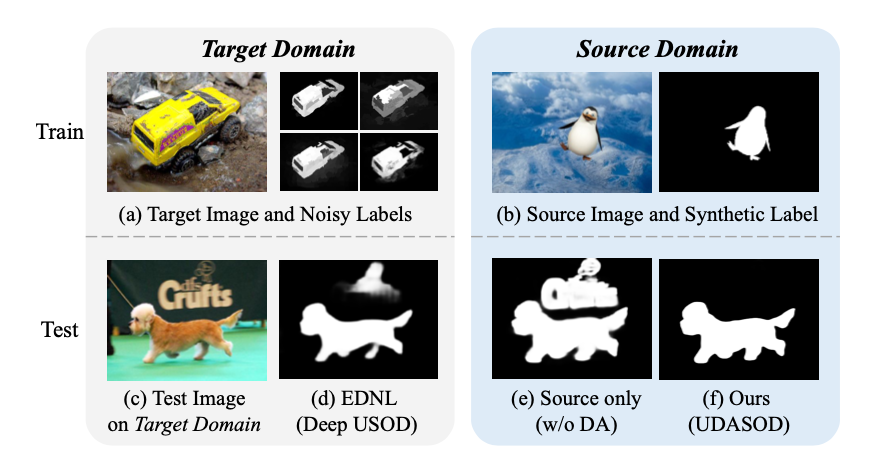
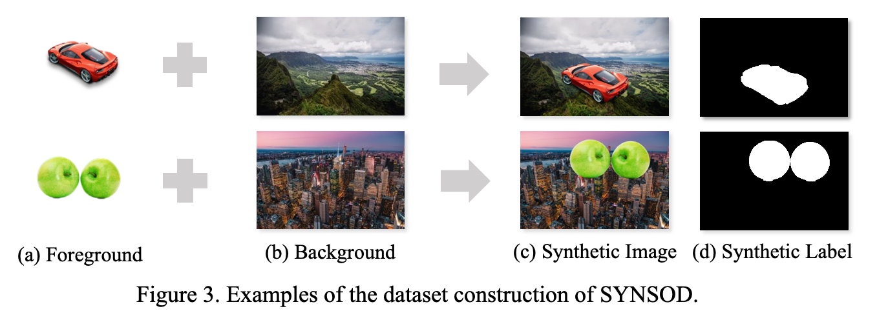
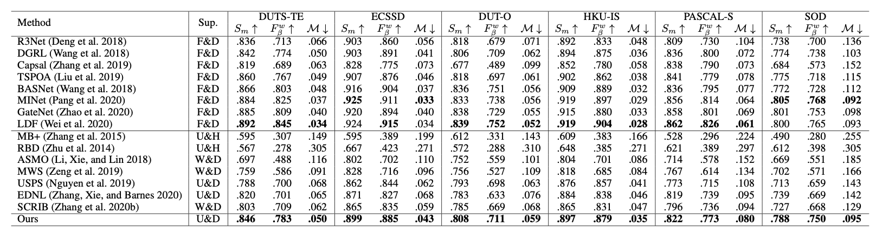

# UDASOD-UPL


**Unsupervised Domain Adaptive Salient Object Detection Through Uncertainty-Aware Pseudo-Label Learning** <br />
Pengxiang Yan, Ziyi Wu, Mengmeng Liu,  Kun Zeng, Liang Lin, Guanbin Li <br />
Thirty-Sixth AAAI Conference on Artificial Intelligence (AAAI), 2022 <br />
\[[Paper](https://arxiv.org/abs/2202.13170)\] [Supp(coming soon)]

## Install

This code is tested with Python=3.7 (via Anaconda3), PyTorch=1.6.0, CUDA=10.2.

```
# Install PyTorch-1.6.0
$ conda install pytorch==1.6.0 torchvision==0.7.0 cudatoolkit=10.2 -c pytorch

# Install Dependencies
$ pip install numpy opencv-python matplotlib tqdm yacs albumentations tensorboard

# Install apex
$ git clone https://github.com/NVIDIA/apex
$ cd apex
$ pip install -v --disable-pip-version-check --no-cache-dir --global-option="--cpp_ext" --global-option="--cuda_ext" ./
```

## Datasets
### Proposed dataset - SYNSOD


In this paper, we proposed a synthetic salient object detection dataset (SYDSOD) including 11,197 images and corresponding pixel-level annotations. The dataset can be obtained from the following links \[[Google Drive](https://drive.google.com/file/d/1x3u-4Wn0t-OwMTbbJyowWqNdHk8jcXUd/view?usp=sharing)\] \[[Baidu Pan](https://pan.baidu.com/s/127VoLupPmVM3M2lGcmjiiA)\] (passwd:sa1k)


### Public datasets
Our code might involve the following datasets \[[PASCAL-S](http://cbi.gatech.edu/salobj/)\], \[[ECSSD](http://www.cse.cuhk.edu.hk/leojia/projects/hsaliency/dataset.html)\], \[[HKU-IS](https://i.cs.hku.hk/~gbli/deep_saliency.html)\], \[[DUT-OMRON](http://saliencydetection.net/dut-omron/)\], \[[DUTS](http://saliencydetection.net/duts/)\], \[[SOD](https://github.com/lartpang/awesome-segmentation-saliency-dataset#sod)\]. Please download them datasets and unzip them into `data` folder when necessary.

## Evaluation 

You can download the predicted saliency maps for evaluation: \[[Google Drive](https://drive.google.com/file/d/1-ZmOvW4Djo3Ej1XLcDR1VgEdWGfsYD-A/view?usp=sharing)\] \[[Baidu Pan](https://pan.baidu.com/s/1n4Y5PuaRZOwR7Zk3d4EsUA)\](passwd: 4q1l)

Modify the config file `config/eval.yaml` and run the evaluation script:
```shell 
$ python eval.py \
$    --exp_config config/eval.yaml \
$    --pred_dir <pred_dir>
```
The predicted saliency masks directory `<pred_dir>` should looks like:
```
├── duts_te
│   └── mask
│       ├── *.png
...
```

## Testing
You can download the trained model weights: \[[Google Drive](https://drive.google.com/file/d/1Fu8swHTQqGYiQRM68DVavPIAw1TTKnII/view?usp=sharing)\] \[[Baidu Pan](https://pan.baidu.com/share/init?surl=D7SUbHCGatwHUSp61_LqPA)\](passwd: 1s86).

Modify the checkpoint path in `config/test.yaml` and run the testing script:
```shell 
$ CUDA_VISIBLE_DEVICES=0 python test.py \
$    --exp_config config/test.yaml \
$    --save_res
```
The predicted saliency masks and evaluation results will be save in `test_res_{date}/`

## Training

1. The saliency detector is based on [LDF](https://github.com/weijun88/LDF). If you want to train from strach, you can download the pretrained resnet50 from [here](https://download.pytorch.org/models/resnet50-19c8e357.pth) and save to `checkpoints/`. You can modify the value of `MODEL.BAKCBONE_PATH` in `config/ldf_train.yaml` to the path of the downloaded weight.

2. Run the following commands to generate the detail and body maps for source domain for LDF training.
``` shell
$ python tools/generate_body_detail.py
```

3. Start training
```shell

$ CUDA_VISIBLE_DEVICES=0 python train.py \
$    --exp_config config/ldf_train.yaml

```

4. (Optional) visualize training process in tensorboard 

```
$ tensorboard --logdir tb_runs
```

5. (Optional) for more training scripts, you can refer to `scripts/training.sh`

## Citation
If you find this work helpful, please consider citing
```
@article{yan2022unsupervised,
  title={Unsupervised Domain Adaptive Salient Object Detection Through Uncertainty-Aware Pseudo-Label Learning},
  author={Yan, Pengxiang and Wu, Ziyi and Liu, Mengmeng and Zeng, Kun and Lin, Liang and Li, Guanbin},
  journal={arXiv preprint arXiv:2202.13170},
  year={2022}
}
```

## Acknowledge
Thanks to the third-party libraries:
* Saliency detector: [LDF](https://github.com/weijun88/LDF) by weijun88
* Evaluation Toolbox: [PySODMetrics](https://github.com/lartpang/PySODMetrics) by lartpang

## Contact
For any questions, feel free to open an issue or contact us:
* Pengxiang Yan [@Kinpzz](https://github.com/Kinpzz), Email: yanpx (at) live.com
* Ziyi Wu [@Z1Wu](https://github.com/Z1Wu), Email: wuzy39 (at) sysu.edu.cn

